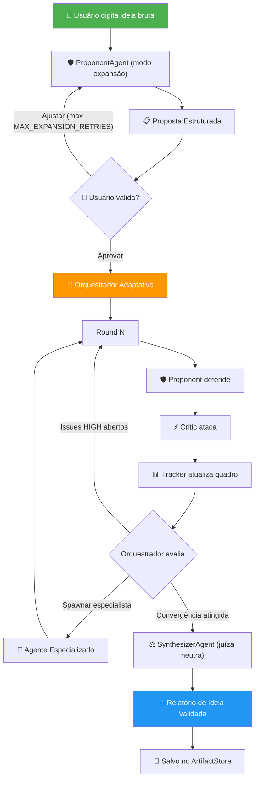

# PRD — IdeaForge 2: Motor de Debate e Validação Profunda de Ideias

**Versão:** 2.0.0-alpha
**Status:** Planejamento — Pré-implementação
**Data:** 23/04/2026
**Autor:** Guilherme Ferreira + Antigravity (Claude Opus 4.6)

---

## 1. Visão Geral do Produto

- **Nome oficial:** IdeaForge 2
- **Versão:** 2.0.0 (derivado do IdeaForge CLI NEXUS v1.4.3c)
- **Slogan:** "Debate profundo. Validação rigorosa. Ideias à prova de bala."
- **Missão:** Receber uma ideia bruta do usuário, expandi-la automaticamente em proposta estruturada, executar um debate adaptativo entre agentes especializados com profundidade variável, e gerar um Relatório de Ideia Validada tão denso que um modelo grande possa transformá-lo em PRD completo com um único prompt.

### Personas

| Persona | Dor | Como o IdeaForge 2 Resolve |
|---|---|---|
| **Lucas, dev indie (28 anos)** | Tem ideias de produto mas não sabe se são viáveis antes de investir semanas | Debate automatizado revela lacunas, riscos e premissas falsas em minutos |
| **Marina, PM sênior (34 anos)** | Precisa validar conceitos antes de escalar para o time de engenharia | Relatório estruturado serve como insumo direto para PRD formal |
| **Rafael, founder técnico (31 anos)** | Quer testar múltiplas hipóteses de produto rapidamente, sem envolver investidores cedo | Cada execução produz um relatório independente e rastreável |

### Diferenciais vs. Abordagens Atuais

| Abordagem Atual | Problema | Como o IdeaForge 2 Supera |
|---|---|---|
| Brainstorm manual com colegas | Subjetivo, sem estrutura, difícil de rastrear decisões | Debate estruturado com rastreamento de issues, decisões e pressupostos |
| Pedir para um ChatGPT/Claude avaliar a ideia | Resposta única, sem contraditório, sem profundidade | Múltiplos agentes com papéis opostos (Proponent vs Critic) garantem cobertura de ângulos |
| IdeaForge v1 (pipeline PRD completo) | Pipeline PRD complexo colapsa em modelos pequenos; debate era etapa subordinada | Debate é o produto central; PRD é gerado depois por modelo grande, com insumo rico |
| Escrever PRD manualmente | Demorado, enviesado pela visão do autor, lacunas invisíveis | Sistema identifica lacunas automaticamente e registra pressupostos não testados |

---

## 2. Arquitetura de Alto Nível e Escolhas Tecnológicas

### Diagrama de Fluxo Principal



> **Nota:** O loop de ajuste do Round 0 é limitado por `MAX_EXPANSION_RETRIES` (default: 3, configurável via env var). Após atingir o limite, o sistema solicita que o usuário aprove a versão atual ou reescreva a ideia original.

### Tecnologias Principais

| Tecnologia | Motivo | Alternativa Rejeitada | Motivo da Rejeição |
|---|---|---|---|
| Python 3.10+ | Ecossistema de IA, tipagem forte com dataclasses, async nativo | Node.js/TypeScript | Menos maduro para orquestração de LLMs locais |
| Ollama API (HTTP) | Execução local de LLMs, sem dependência de cloud, gratuito | LangChain / LlamaIndex | Overhead massivo, abstração desnecessária para chamadas diretas |
| Pytest | Framework de testes maduro, fixtures, parametrize | unittest | Menos expressivo, mais boilerplate |
| Markdown | Formato de saída universal, legível por humanos e LLMs | JSON / HTML | Menos legível, mais difícil de editar manualmente |
| Regex (re) | Parsing determinístico do output dos agentes, zero dependência | spaCy / NLP | Overhead de instalação, modelo de 500MB para parsing simples |

### Padrões de Design

| Padrão | Onde é Aplicado |
|---|---|
| **Blackboard** | Estado global centralizado do pipeline — todos os agentes leem/escrevem no quadro |
| **Observer** | DebateStateTracker observa respostas dos agentes e extrai issues/decisões |
| **Strategy** | Agentes especializados são strategies intercambiáveis no debate |
| **Template Method** | ProponentAgent com dois modos (expansão vs defesa) via mesmo método base |
| **Factory** | Orquestrador spawna agentes do banco de perfis pré-definidos |
| **Chain of Responsibility** | Parser de 3 níveis: tabela → bullets → texto livre |

### Modelo de Deploy

- **CLI local** — executado via terminal do usuário
- **Sem servidor** — sem containers, sem cloud, sem Docker
- **Dependência única** — Ollama rodando localmente (ou endpoint de cloud provider)

---

## 3. Árvore de Diretórios e Esqueleto do Projeto

```
idea-forge/
├── .ai-context                         → Instruções de contexto para IA
├── .humano                             → Guia de workflow para o humano
├── .gitignore
├── iniciar.bat                         → Script de inicialização Windows
│
├── docs/
│   ├── PRD.md                          → ESTE DOCUMENTO
│   ├── CURRENT_STATE.md                → Estado atual do sistema (≤1500 tokens)
│   ├── DECISION_LOG.md                 → Registro de decisões por fase
│   ├── BACKLOG_FUTURO.md               → Roadmap estratégico com critérios binários
│   ├── ARCHIVING_PROTOCOL.md           → Instruções de arquivamento pós-fase
│   └── archive/                        → Blueprints arquivados (.resolved)
│
├── workflow/
│   ├── 🟢 GERAR DOCUMENTACAO PRD.md    → Protocolo de geração de PRD
│   ├── ⭐ Protocolo NEXUS.md           → Protocolo de blueprint por fase
│   └── 👍 Protocolo - Arquivamento.md  → Protocolo de arquivamento progressivo
│
├── idea-forge/
│   └── src/
│       ├── agents/                     → Agentes do debate
│       │   ├── proponent_agent.py      → Defensor da ideia (modo expansão + defesa)
│       │   ├── critic_agent.py         → Analista crítico
│       │   ├── synthesizer_agent.py    → [NOVO] Juíza neutra — gera relatório final
│       │   └── specialist_profiles.py  → [NOVO] Banco de perfis de agentes especializados
│       │
│       ├── cli/
│       │   └── main.py                 → Entry point CLI (simplificado)
│       │
│       ├── config/
│       │   └── settings.py             → Configurações (modelo, endpoint, limites)
│       │
│       ├── conversation/
│       │   └── conversation_manager.py → Gerenciador de histórico
│       │
│       ├── core/                       → Núcleo do sistema
│       │   ├── adaptive_orchestrator.py → [NOVO] Orquestrador adaptativo
│       │   ├── artifact_store.py       → Persistência de artefatos (mantido)
│       │   ├── blackboard.py           → Estado global (mantido)
│       │   ├── controller.py           → Controlador do pipeline (reescrito)
│       │   ├── convergence_detector.py → [NOVO] Detecção de saturação do debate
│       │   ├── pipeline_logger.py      → Logger estruturado (mantido)
│       │   ├── prompt_templates.py     → Templates de prompt (reescrito)
│       │   ├── report_generator.py     → [NOVO] Montagem do relatório final
│       │   ├── stream_handler.py       → Handler de streaming (mantido)
│       │   └── validation_board.py     → [NOVO] Quadro de validações expandido
│       │
│       ├── debate/                     → Motor de debate
│       │   ├── debate_engine.py        → Engine do debate (refatorado)
│       │   └── debate_state_tracker.py → Tracker de estado (expandido)
│       │
│       └── models/                     → Providers de LLM
│           ├── model_provider.py       → Interface abstrata
│           ├── ollama_provider.py      → Provider Ollama local
│           └── cloud_provider.py       → Provider cloud (infraestrutura — sem RF dedicado, coberto por RNF-05)
│
├── tests/                             → Suíte de testes TDD
│   ├── conftest.py                    → Fixtures compartilhadas, MockProvider
│   ├── fixtures/                      → Dados de teste pré-definidos
│   │   ├── mock_critic_responses.py
│   │   ├── mock_proponent_responses.py
│   │   ├── sample_ideas.py
│   │   └── expected_tracker_states.py
│   ├── unit/                          → Testes unitários (sem LLM)
│   │   ├── test_validation_board.py
│   │   ├── test_debate_state_tracker.py
│   │   ├── test_adaptive_orchestrator.py
│   │   ├── test_convergence_detector.py
│   │   ├── test_parser_levels.py
│   │   ├── test_blackboard.py
│   │   ├── test_artifact_store.py
│   │   ├── test_report_generator.py
│   │   └── test_proponent_modes.py
│   ├── integration/                   → Testes com MockProvider
│   │   ├── test_debate_flow.py
│   │   ├── test_adaptive_rounds.py
│   │   ├── test_agent_spawning.py
│   │   └── test_full_pipeline.py
│   └── smoke/                         → Testes com modelo real
│       ├── test_real_debate_20b.py
│       └── test_report_quality.py
│
└── .forge/                            → Estado persistido do pipeline
    ├── blackboard_state.json
    └── artifacts/
```

### Convenções de Nomenclatura

| Elemento | Convenção | Exemplo |
|---|---|---|
| Arquivos Python | `snake_case.py` | `adaptive_orchestrator.py` |
| Classes | `PascalCase` | `AdaptiveOrchestrator` |
| Métodos/funções | `snake_case` | `should_continue()` |
| Constantes | `UPPER_SNAKE_CASE` | `MAX_ROUNDS` |
| Testes | `test_<módulo>.py` / `test_<comportamento>()` | `test_tracker_extracts_issues()` |
| IDs de issue | `ISS-XX` | `ISS-01`, `ISS-15` |
| IDs de decisão | `D-XX` | `D-01`, `D-08` |
| IDs de pressuposto | `P-XX` | `P-01`, `P-05` |

---

## 4. Requisitos Funcionais — O Catálogo de Ações

### RF-001: Recepção de Ideia Bruta
```
→ Ação do Usuário: Digita uma ideia de projeto em texto livre via CLI
→ Fluxo de Código: CLI → Controller → ProponentAgent.expand()
→ Módulo Crítico: src/cli/main.py + src/agents/proponent_agent.py
→ Status: Não implementado
```

### RF-002: Recepção de Constraints (Opcional)
```
→ Ação do Usuário: Fornece restrições via flags CLI (--constraint "deve ser monolito")
→ Fluxo de Código: CLI → Controller → injeta no contexto inicial do debate
→ Módulo Crítico: src/cli/main.py
→ Status: Não implementado
```

### RF-003: Expansão da Ideia (Round 0)
```
→ Ação do Usuário: Nenhuma (automático)
→ Fluxo de Código: ProponentAgent recebe ideia bruta, gera proposta estruturada
  com 7 seções: Problema, Solução, Público-Alvo, Premissas, Diferencial, Riscos, Constraints
→ Módulo Crítico: src/agents/proponent_agent.py (modo expansão)
→ Status: Não implementado
→ Critério de Aceite: Proposta gerada tem ≥ 7 seções com conteúdo não-vazio
```

### RF-004: Validação da Proposta pelo Usuário
```
→ Ação do Usuário: Revisa proposta expandida, escolhe [Aprovar / Ajustar / Refazer]
→ Fluxo de Código: CLI exibe proposta → usuário escolhe → se "Ajustar",
  usuário digita correções → ProponentAgent reprocessa
→ Módulo Crítico: src/cli/main.py + src/core/controller.py
→ Status: Não implementado
→ Critério de Aceite: Loop de ajuste funciona até o usuário aprovar
```

### RF-005: Debate Estruturado entre Agentes
```
→ Ação do Usuário: Nenhuma (automático após aprovação da proposta)
→ Fluxo de Código: AdaptiveOrchestrator inicia loop →
  Proponent defende → Critic ataca → Tracker atualiza →
  Orquestrador avalia → repete ou para
→ Módulo Crítico: src/core/adaptive_orchestrator.py + src/debate/debate_engine.py
→ Status: Parcialmente implementado (DebateEngine existe, orquestrador não)
→ Critério de Aceite: Debate executa ≥ 2 rounds com issues extraídos pelo Tracker
```

### RF-006: Rastreamento de Issues
```
→ Ação do Usuário: Nenhuma (automático)
→ Fluxo de Código: DebateStateTracker parseia output do Critic →
  registra IssueRecord com ID, severidade, categoria, status
→ Módulo Crítico: src/debate/debate_state_tracker.py
→ Status: Implementado (existente no v1, será expandido)
→ Critério de Aceite: ≥ 80% dos issues visíveis no texto são capturados pelo parser
→ Mecanismo de Validação: Fixtures com respostas de Critic pré-definidas (tabela, bullets,
  texto livre) onde a quantidade exata de issues é conhecida antecipadamente.
  Teste verifica: len(tracker.extract(fixture)) >= expected_count * 0.8
```

### RF-007: Rastreamento de Decisões Validadas
```
→ Ação do Usuário: Nenhuma (automático)
→ Fluxo de Código: ValidationBoard parseia consensos do debate →
  registra DecisionRecord com status PROPOSED → VALIDATED
→ Módulo Crítico: src/core/validation_board.py
→ Status: Não implementado
→ Critério de Aceite: Decisões validadas NÃO são rediscutidas em rounds subsequentes
```

### RF-008: Rastreamento de Pressupostos
```
→ Ação do Usuário: Nenhuma (automático)
→ Fluxo de Código: ValidationBoard extrai premissas da proposta inicial →
  registra AssumptionRecord com status UNTESTED → VALIDATED/FLAGGED
→ Módulo Crítico: src/core/validation_board.py
→ Status: Não implementado
→ Critério de Aceite: Pressupostos da proposta são registrados automaticamente e
  atualizados durante o debate
```

### RF-009: Rounds Dinâmicos (Orquestrador Adaptativo)
```
→ Ação do Usuário: Nenhuma (automático)
→ Fluxo de Código: AdaptiveOrchestrator consulta Tracker →
  se issues HIGH abertos: continua →
  se convergência detectada: para →
  respeita limite rígido MAX_ROUNDS
→ Módulo Crítico: src/core/adaptive_orchestrator.py + src/core/convergence_detector.py
→ Status: Não implementado
→ Critério de Aceite: Debate para quando não há issues HIGH abertos OU atinge MAX_ROUNDS
```

### RF-010: Spawning de Agentes Especializados
```
→ Ação do Usuário: Nenhuma (automático)
→ Fluxo de Código: Orquestrador conta issues por categoria →
  se ≥ 3 issues na mesma categoria → spawna agente do banco de perfis →
  agente participa dos rounds seguintes
→ Módulo Crítico: src/core/adaptive_orchestrator.py + src/agents/specialist_profiles.py
→ Status: Não implementado
→ Critério de Aceite: Com 3+ issues SECURITY, SecurityAnalyst é spawned automaticamente,
  respeitando limite MAX_AGENTS
→ Caso MAX_AGENTS atingido: spawn é bloqueado silenciosamente, warning logado via
  pipeline_logger ("Spawn de {agent} bloqueado — MAX_AGENTS atingido"), evento registrado
  na seção "Limitações da Execução" do relatório final
```

### RF-011: Detecção de Convergência
```
→ Ação do Usuário: Nenhuma (automático)
→ Fluxo de Código: ConvergenceDetector analisa últimos N rounds →
  se nenhum issue novo em 2 rounds consecutivos → convergência = True
→ Módulo Crítico: src/core/convergence_detector.py
→ Status: Não implementado
→ Critério de Aceite: Debate para automaticamente quando 2 rounds consecutivos
  não geram novos issues
```

### RF-012: Prevenção de Rediscussão
```
→ Ação do Usuário: Nenhuma (automático)
→ Fluxo de Código: Prompt dos agentes inclui "DECISÕES VALIDADAS — NÃO revisitar"
  + "ISSUES JÁ REGISTRADOS — NÃO repetir"
→ Módulo Crítico: src/debate/debate_engine.py + src/core/validation_board.py
→ Status: Parcialmente implementado (issues têm dedup, decisões não)
→ Critério de Aceite: Zero issues duplicados + zero decisões VALIDATED rediscutidas
```

### RF-013: Parser de 3 Níveis
```
→ Ação do Usuário: Nenhuma (automático)
→ Fluxo de Código: Tracker tenta parse nível 1 (tabela Markdown) →
  fallback nível 2 (bullets com severidade) →
  fallback nível 3 (heurística em texto livre)
→ Módulo Crítico: src/debate/debate_state_tracker.py
→ Status: Parcialmente implementado (nível 1 e 2 existem, nível 3 não)
→ Critério de Aceite: Extrai issues de texto livre com ≥ 60% de precisão
```

### RF-014: Síntese Final (Juíza Neutra)
```
→ Ação do Usuário: Nenhuma (automático)
→ Fluxo de Código: SynthesizerAgent recebe quadro de validações (~2300 chars) →
  gera Relatório de Ideia Validada em Markdown
→ Módulo Crítico: src/agents/synthesizer_agent.py + src/core/report_generator.py
→ Status: Não implementado
→ Critério de Aceite: Relatório tem todas as seções obrigatórias e ≥ 3000 chars
```

### RF-015: Persistência do Relatório
```
→ Ação do Usuário: Nenhuma (automático)
→ Fluxo de Código: ReportGenerator monta Markdown →
  ArtifactStore persiste → arquivo .md salvo em disco
→ Módulo Crítico: src/core/report_generator.py + src/core/artifact_store.py
→ Status: Parcialmente implementado (ArtifactStore existe)
→ Critério de Aceite: Arquivo .md legível salvo com timestamp no nome
```

### RF-016: Modo Interativo (Opcional)
```
→ Ação do Usuário: Flag --interactive na CLI
→ Fluxo de Código: A cada 3 rounds, CLI pausa e pergunta "Continuar? (s/n)"
→ Módulo Crítico: src/cli/main.py
→ Status: Não implementado
→ Critério de Aceite: Flag funciona sem afetar o fluxo automático padrão
```

---

## 5. Requisitos Não Funcionais — Metas de Qualidade

| ID | Categoria | Requisito | Métrica | Target | Status |
|---|---|---|---|---|---|
| RNF-01 | Performance | Overhead de orquestração entre rounds deve ser negligível | Tempo entre fim de inferência de um agente e início do próximo (excluindo LLM) | ≤ 500ms (valor inicial — sujeito a revisão nos smoke tests se parsing de textos grandes ultrapassar) | A definir |
| RNF-02 | Performance | Input dos agentes deve ser compacto | Chars por prompt de agente | ≤ 3000 chars | A definir |
| RNF-03 | Resiliência | Pipeline não crasha se modelo retornar lixo | Taxa de crash em 10 execuções | 0 crashes | A definir |
| RNF-04 | Resiliência | Tracker degrada graciosamente se parser falhar | Comportamento com formato inesperado | Lista vazia, debate continua | A definir |
| RNF-05 | Portabilidade | Sistema funciona com modelos de 3B a 300B | Modelos testados | ≥ 3 modelos distintos | A definir |
| RNF-06 | Testabilidade | Cobertura de testes unitários | % de linhas cobertas nos módulos core | ≥ 80% | A definir |
| RNF-07 | Determinismo | Código de orquestração é 100% determinístico | Dependências de LLM na lógica de fluxo | 0 chamadas LLM para decisões de fluxo | A definir |
| RNF-08 | Usabilidade | CLI é autoexplicativa | Passos para primeira execução | ≤ 3 comandos | A definir |
| RNF-09 | Manutenibilidade | Cada módulo tem responsabilidade única | Acoplamento entre módulos | Zero imports circulares | A definir |
| RNF-10 | Observabilidade | Pipeline emite logs estruturados | Cobertura de eventos logados | Cada task tem log de início/fim | Parcialmente implementado |

---

## 6. Análise Técnica Profunda e Justificativa de Stack

### Python 3.10+

- **O que é:** Linguagem interpretada de alto nível
- **Por que:** Ecossistema nativo para IA/ML, tipagem com `dataclasses` e `typing`, comunidade ativa em agentes LLM
- **Como funciona aqui:** Linguagem principal do sistema inteiro. Dataclasses para modelos de dados (`IssueRecord`, `DecisionRecord`, `Artifact`). Regex para parsing determinístico.
- **Riscos:** GIL limita paralelismo real (irrelevante — pipeline é sequencial por design)
- **Mitigação:** N/A

### Ollama HTTP API

- **O que é:** Server local para executar LLMs open-source
- **Por que:** Zero custo, execução offline, suporta modelos de 1B a 300B, API simples
- **Como funciona aqui:** `OllamaProvider` faz POST para `/api/generate` com streaming. `StreamHandler` parseia chunks JSON em tempo real, separando thinking de content.
- **Riscos:** Modelo pode ficar indisponível, timeout em modelos grandes
- **Mitigação:** Timeout dinâmico (90-120s), fallback para `cloud_provider.py`

### Pytest

- **O que é:** Framework de testes Python
- **Por que:** Fixtures reutilizáveis, parametrize para testar múltiplos cenários, assert rico com diffs
- **Como funciona aqui:** `conftest.py` com `MockProvider` compartilhado. Fixtures em `tests/fixtures/` com respostas pré-definidas. Testes unitários rodam em < 1 segundo.
- **Riscos:** Nenhum identificado
- **Mitigação:** N/A

### Regex (re) para Parsing

- **O que é:** Expressões regulares nativas do Python
- **Por que:** Zero dependência, determinístico, rápido, testável
- **Como funciona aqui:** `DebateStateTracker` usa regex para extrair tabelas de issues, bullets com severidade, e texto livre categorizado. Parser de 3 níveis com degradação graciosa.
- **Riscos:** Modelos muito pequenos (1B) geram formatos imprevisíveis que quebram os regex
- **Mitigação:** Parser nível 3 com heurística semântica (keywords como "segurança" → SECURITY)

---

## 7. Mapeamento Mestre de Componentes Críticos

### 7.1 AdaptiveOrchestrator

| Campo | Detalhe |
|---|---|
| Quem usa? | Controller (invocado uma vez por pipeline) |
| Pra quê? | Decidir se o debate continua, para, ou precisa de agente especializado |
| Quando roda? | Após cada round completo (Proponent + Critic) |
| Lógica de decisão | 1. Consulta Tracker → 2. Conta issues HIGH abertos → 3. Verifica convergência → 4. Verifica categorias dominantes → 5. Retorna: CONTINUE / STOP / SPAWN(categoria) |
| O que acontece se falhar? | Degradação: usa rounds fixos (fallback para 3 rounds) |
| Referência | `src/core/adaptive_orchestrator.py` |

**Limites rígidos (inegociáveis):**

| Limite | Valor | Configurável | Motivo |
|---|---|---|---|
| `MAX_ROUNDS` | 10 | Sim (env var) | Prevenir loop infinito |
| `MAX_AGENTS` | 5 | Sim (env var) | Prevenir explosão de complexidade |
| `MIN_ROUNDS` | 2 | Sim (env var) | Garantir profundidade mínima |
| `MAX_EXPANSION_RETRIES` | 3 | Sim (env var) | Prevenir loop infinito no Round 0 |

### 7.2 ValidationBoard

| Campo | Detalhe |
|---|---|
| Quem usa? | DebateEngine (escreve), Agentes (lêem via prompt), ReportGenerator (lê) |
| Pra quê? | Manter estado de issues, decisões e pressupostos entre rounds |
| Quando roda? | Atualizado após cada turno de cada agente |
| Lógica de negócio | Três registros: IssueRecord (OPEN→RESOLVED/DEFERRED), DecisionRecord (PROPOSED→VALIDATED/CONTESTED), AssumptionRecord (UNTESTED→VALIDATED/FLAGGED) |
| O que acontece se falhar? | Degradação: debate continua sem tracking (perde qualidade mas não crasha) |
| Referência | `src/core/validation_board.py` |

**Categorias de Issues:**

| Categoria | Keyword PT | Keyword EN | Exemplo |
|---|---|---|---|
| SECURITY | segurança, vulnerabilidade, autenticação | security, auth, vulnerability | "Sem autenticação no endpoint X" |
| CORRECTNESS | erro, incorreto, bug, contradição | error, incorrect, contradiction | "RF-03 contradiz RF-07" |
| COMPLETENESS | falta, ausente, incompleto, lacuna | missing, incomplete, gap | "Não define formato de export" |
| CONSISTENCY | inconsistente, conflito, diverge | inconsistent, conflict | "Tech stack difere entre seções" |
| FEASIBILITY | inviável, irrealista, impossível, custo | infeasible, unrealistic | "Prazo de 1 semana para ML pipeline" |
| SCALABILITY | escala, performance, gargalo, bottleneck | scale, bottleneck, performance | "Banco SQLite não escala para 1M users" |

### 7.3 ProponentAgent (Dois Modos)

| Modo | Quando | Prompt | Output Esperado |
|---|---|---|---|
| **Expansão** (Round 0) | Antes do debate | "Expanda esta ideia em proposta estruturada com 7 seções" | Proposta com Problema, Solução, Público, Premissas, Diferencial, Riscos, Constraints |
| **Defesa** (Round 1+) | Durante o debate | "Endereça estes issues, defenda com argumentos técnicos" | Pontos Aceitos + Defesa Técnica + Melhorias Propostas |

### 7.4 SynthesizerAgent (Juíza Neutra)

| Campo | Detalhe |
|---|---|
| Quem usa? | Controller (invocado uma vez ao final do debate) |
| Pra quê? | Produzir síntese imparcial do debate em formato de relatório |
| Quando roda? | Após o orquestrador decidir STOP |
| Input | Quadro de validações (~2300 chars) + Ideia original + Estatísticas |
| Output | Relatório de Ideia Validada (~3000-6000 chars) |
| Referência | `src/agents/synthesizer_agent.py` |

**O que a juíza NÃO recebe:**
- Respostas individuais dos agentes (parciais, enviesadas)

**O que a juíza RECEBE:**
- Quadro de validações: decisões VALIDATED, issues RESOLVED/OPEN, pressupostos VALIDATED/FLAGGED
- Ideia original do usuário
- Estatísticas: rounds executados, agentes participantes, taxa de resolução

> **Trade-off arquitetural (D-009):** A juíza não recebe o transcript completo do debate. Esta é uma decisão deliberada — dados estruturados do quadro de validações são suficientes para modelo pequeno e produzem sínteses consistentes. Modo com transcript completo planejado para v2.1 (quando modelo grande estiver disponível para a juíza).

### 7.5 ConvergenceDetector

| Campo | Detalhe |
|---|---|
| Quem usa? | AdaptiveOrchestrator |
| Pra quê? | Detectar quando o debate esgotou (sem novos issues) |
| Quando roda? | Consultado pelo orquestrador após cada round |
| Lógica | Se últimos 2 rounds não geraram issues novos → convergência = True. Se Proponent está repetindo argumentos (Jaccard similarity > 0.7) → saturação = True |
| Método de similaridade | Jaccard em bag-of-words com filtro de stopwords PT — 100% programático, zero LLM (respeita C-003) |
| Referência | `src/core/convergence_detector.py` |

**Implementação de similaridade:**
```python
STOPWORDS_PT = {"o", "a", "de", "que", "para", "com", "em", "é", "um", "uma",
                "os", "as", "do", "da", "dos", "das", "no", "na", "nos", "nas",
                "se", "ao", "por", "mais", "não", "como", "mas", "ou", "este",
                "essa", "esse", "isso", "ser", "ter", "foi", "são", "está"}

def _similarity(self, text_a: str, text_b: str) -> float:
    words_a = set(text_a.lower().split()) - STOPWORDS_PT
    words_b = set(text_b.lower().split()) - STOPWORDS_PT
    intersection = words_a & words_b
    union = words_a | words_b
    return len(intersection) / len(union) if union else 0.0
```
> **Nota:** Threshold de 0.7 escolhido para evitar falsos positivos. Stopwords PT removidas para que o overlap meça conteúdo semântico, não ruído gramatical.

---

## 8. Pipelines Especiais

### 8.1 Pipeline de Debate Adaptativo

Ciclo de vida completo:

```
INÍCIO
  │
  ├─ 1. Controller recebe ideia + constraints
  ├─ 2. Proponent expande ideia (Round 0)
  ├─ 3. Usuário valida proposta
  ├─ 4. Tracker registra premissas como UNTESTED
  │
  ├─ LOOP (Round N = 1..MAX_ROUNDS):
  │   ├─ 5. Proponent recebe: ideia + tracker.get_issues_for_proponent() + última_crítica
  │   ├─ 6. Proponent gera defesa
  │   ├─ 7. Tracker extrai resoluções da defesa
  │   ├─ 8. Critic recebe: ideia + tracker.get_open_issues_prompt() + última_defesa
  │   ├─ 9. Critic gera crítica
  │   ├─ 10. Tracker extrai novos issues da crítica
  │   ├─ 11. ValidationBoard atualiza decisões e pressupostos
  │   ├─ 12. Orquestrador avalia:
  │   │     ├─ Issues HIGH abertos? → CONTINUE
  │   │     ├─ ≥ 3 issues mesma categoria? → SPAWN especialista
  │   │     ├─ Convergência detectada? → STOP
  │   │     └─ MAX_ROUNDS atingido? → STOP (forçado)
  │   └─ 13. Se SPAWN: adiciona agente ao próximo round
  │
  ├─ 14. SynthesizerAgent recebe quadro de validações
  ├─ 15. ReportGenerator monta relatório final
  ├─ 16. ArtifactStore persiste relatório + transcript
  │
  FIM
```

**Fallback em caso de falha:**

| Falha | Detecção | Ação |
|---|---|---|
| Modelo retorna string vazia | `len(response) < 50` | Retry (max 2), depois skip round |
| Modelo retorna formato inválido | Parser nível 1+2+3 falha | Lista vazia de issues, round ignorado |
| Ollama timeout | `requests.exceptions.Timeout` | Retry com timeout maior (180s) |
| Ollama offline | `requests.exceptions.ConnectionError` | Mensagem de erro, pipeline para |
| MAX_ROUNDS atingido com issues HIGH | Orquestrador conta issues | Warning no relatório, lista issues abertos |
| SynthesizerAgent falha (timeout ou output < 500 chars) | `len(report) < 500` ou exception | Retry 1x com prompt simplificado. Se falhar novamente: ReportGenerator gera relatório mínimo direto do ValidationBoard (dump estruturado de decisões, issues e pressupostos) com banner `⚠️ Relatório gerado em modo fallback sem síntese`. Dados são 100% preservados. |

### 8.2 Pipeline de Contexto dos Agentes

Como cada agente recebe informação sem sobrecarregar o modelo:

```
PARA CADA AGENTE EM CADA ROUND:
  │
  ├─ Bloco 1: Ideia Original (fixa, ~500 chars)
  │   └─ Proposta expandida aprovada pelo usuário
  │
  ├─ Bloco 2: Estado do Tracker (~400-1000 chars, cresce devagar)
  │   ├─ Para Proponent: tracker.get_issues_for_proponent()
  │   │   → "Issues que DEVE endereçar: ISS-01 [HIGH], ISS-03 [MED]..."
  │   ├─ Para Critic: tracker.get_open_issues_prompt()
  │   │   → "Issues já registrados (NÃO repita): ISS-01, ISS-02..."
  │   └─ Para ambos: validation_board.get_validated_decisions()
  │       → "Decisões validadas (NÃO revisitar): D-01, D-02..."
  │
  ├─ Bloco 3: Última Resposta do Par (~800 chars)
  │   └─ Apenas a resposta do round anterior, não acumulado
  │
  TOTAL: ~1700-2300 chars por prompt (cabe em modelo de 1B)
```

**Regra inviolável:** Agentes NUNCA recebem transcript acumulado de rounds anteriores. O Tracker é a única ponte entre rounds.

---

## 9. Integrações Externas

### 9.1 Ollama

- **O que é:** Server local para execução de LLMs open-source
- **Por que:** Gratuito, offline, suporta dezenas de modelos
- **Variáveis de ambiente:** `OLLAMA_ENDPOINT` (default: `http://localhost:11434/api/generate`), `MODEL_NAME` (default: `gpt-oss:20b-cloud`)
- **Como configurar:** Instalar Ollama → `ollama pull <modelo>` → sistema detecta automaticamente
- **Como estender:** Adicionar novo provider implementando `ModelProvider` ABC
- **Fallback:** CloudProvider se Ollama não disponível

---

## 10. Segurança e Autenticação

**Não aplicável para este projeto.** IdeaForge 2 é um CLI local sem autenticação, sem dados sensíveis de usuários, sem endpoints expostos.

Considerações relevantes:
- Ideias do usuário são salvas apenas localmente em `.forge/artifacts/`
- Nenhum dado é transmitido para serviços externos (exceto Ollama local ou cloud provider, se configurado)
- Logs não contêm dados sensíveis — apenas metadados do pipeline

---

## 11. Infraestrutura e DevOps

### Variáveis de Ambiente

| Variável | Obrigatória | Default | Descrição |
|---|---|---|---|
| `LLM_PROVIDER` | Sim | `ollama` | Provider de LLM (`ollama` ou `cloud`) |
| `MODEL_NAME` | Sim | `gpt-oss:20b-cloud` | Nome do modelo no Ollama |
| `OLLAMA_ENDPOINT` | Não | `http://localhost:11434/api/generate` | URL do endpoint Ollama |
| `MAX_ROUNDS` | Não | `10` | Limite máximo de rounds do debate |
| `MAX_AGENTS` | Não | `5` | Limite máximo de agentes simultâneos |
| `MIN_ROUNDS` | Não | `2` | Mínimo de rounds antes de avaliar convergência |
| `MAX_EXPANSION_RETRIES` | Não | `3` | Limite de iterações no loop de ajuste do Round 0 |

### Comandos de Execução

```bash
# Executar debate (modo automático)
python -m src.cli.main --idea "sua ideia aqui" --model gpt-oss:20b-cloud

# Executar debate (modo interativo)
python -m src.cli.main --interactive

# Executar com constraints
python -m src.cli.main --idea "..." --constraint "deve ser monolito" --constraint "budget $500/mês"

# Rodar testes unitários
pytest tests/unit/ -v

# Rodar testes de integração
pytest tests/integration/ -v

# Rodar testes completos
pytest tests/ -v --tb=short

# Rodar smoke test com modelo real
pytest tests/smoke/ -v --timeout=600
```

---

## 12. Extensibilidade e Customização

### Como Adicionar um Novo Agente Especializado em 5 Passos

1. **Definir perfil** em `src/agents/specialist_profiles.py`:
   ```python
   "SCALABILITY": {
       "name": "ScalabilityReviewer",
       "system_prompt": "Você é especialista em escalabilidade...",
       "trigger_threshold": 3,  # spawna quando ≥ 3 issues SCALABILITY
   }
   ```

2. **Registrar categoria** em `ValidationBoard.CATEGORIES`

3. **Adicionar keywords** no parser nível 3 (heurística):
   ```python
   "SCALABILITY": ["escala", "performance", "gargalo", "bottleneck", "throughput"]
   ```

4. **Escrever teste** em `tests/unit/test_agent_spawning.py`

5. **Rodar suíte completa** → todos os testes passam → commit

### Pontos de Extensão

| Ponto | Arquivo | O que pode ser estendido |
|---|---|---|
| Novo provider de LLM | `src/models/` | Implementar `ModelProvider` ABC |
| Novo agente especializado | `src/agents/specialist_profiles.py` | Adicionar perfil ao banco |
| Nova categoria de issue | `src/core/validation_board.py` | Adicionar ao enum de categorias |
| Novo formato de relatório | `src/core/report_generator.py` | Adicionar método de output |
| Novas regras de convergência | `src/core/convergence_detector.py` | Adicionar heurísticas |

---

## 13. Limitações Conhecidas

| ID | Limitação | Impacto | Workaround | Quando Será Resolvida |
|---|---|---|---|---|
| LIM-01 | Modelos < 3B frequentemente não seguem formato de tabela | Parser extrai menos issues, quadro de validações mais esparso | Parser nível 3 (heurística) mitiga parcialmente | v2.1 — calibração de prompts por faixa de modelo |
| LIM-02 | Relatório final depende da qualidade do debate | Se o debate for superficial, o relatório também será | Usar modelo de ≥ 7B para garantir profundidade | N/A — limitação fundamental de LLMs |
| LIM-03 | Convergência é heurística, não exata | Pode parar cedo demais ou continuar desnecessariamente | `--interactive` permite controle manual | v2.2 — métricas de qualidade de debate |
| LIM-04 | Spawning de agentes baseado em contagem, não em julgamento | Pode spawnar agente desnecessário se issues forem falsos positivos | Threshold configurável + limite MAX_AGENTS | v2.2 — meta-avaliador |
| LIM-05 | Sem suporte a múltiplos modelos simultâneos | Todos os agentes usam o mesmo modelo | Configurar CloudProvider para agentes específicos | v2.3 — multi-model |

> **Nota:** O trade-off do SynthesizerAgent não receber transcript completo (anteriormente LIM-05) foi reclassificado como decisão arquitetural deliberada (D-009). Ver seção 7.4 para justificativa.

---

## 14. Roadmap Inferido

| Versão | Foco | Features Principais | Estimativa |
|---|---|---|---|
| **v2.0** (atual) | MVP do debate adaptativo | Round 0 + Debate + Tracker expandido + Orquestrador + Relatório | 5 fases (~2 semanas) |
| **v2.1** | Portabilidade de modelo | Calibração de prompts por faixa (1B/3B/20B), modo dual para SynthesizerAgent | 2-3 fases |
| **v2.2** | Qualidade de debate | Métricas de profundidade, meta-avaliador LLM (modelo grande), scoring de relatório | 2-3 fases |
| **v2.3** | Multi-model | Agentes diferentes podem usar modelos diferentes (Critic com 20B, Proponent com 7B) | 1-2 fases |
| **v3.0** | Reunificação | Orchestrator que decide: modo debate-only vs debate+PRD (IdeaForge 1 + 2 unificados) | A planejar |

---

## 15. Guia Mestre de Replicação

### Pré-requisitos

| Requisito | Versão Mínima | Comando de Verificação |
|---|---|---|
| Python | 3.10+ | `python --version` |
| pip | 21+ | `pip --version` |
| Ollama | 0.1+ | `ollama --version` |
| Modelo LLM | qualquer | `ollama list` |
| Git | 2.30+ | `git --version` |

### Passo a Passo

```bash
# 1. Clonar repositório
git clone https://github.com/GuilhermeFerreira42/idea-forge.git
cd idea-forge

# 2. Checkout da branch v2
git checkout v2-debate-only

# 3. Instalar dependências
pip install requests pytest

# 4. Garantir que Ollama está rodando
ollama serve &  # ou abrir Ollama desktop

# 5. Baixar modelo (se necessário)
ollama pull gpt-oss:20b-cloud  # ou qualquer modelo disponível

# 6. Configurar variáveis (opcional — defaults funcionam)
# Editar src/config/settings.py se necessário

# 7. Rodar testes para validar instalação
pytest tests/unit/ -v

# 8. Executar primeira validação de ideia
python -m src.cli.main --idea "Sua ideia aqui"

# 9. Verificar output
# O relatório será salvo como: RELATORIO_VALIDACAO_YYYYMMDD_HHMMSS.md

# 10. Smoke test (opcional — requer modelo rodando)
pytest tests/smoke/ -v --timeout=600
```

### Verificação Pós-Setup

| Check | Como Verificar | Resultado Esperado |
|---|---|---|
| Python instalado | `python --version` | 3.10+ |
| Ollama acessível | `curl http://localhost:11434/api/tags` | JSON com lista de modelos |
| Testes passam | `pytest tests/unit/ -v` | 100% passing |
| Pipeline funciona | Rodar com `--idea "app de notas"` | Relatório .md gerado sem crash |

---

## Formato do Artefato Final — Relatório de Ideia Validada

O relatório gerado ao final do debate tem a seguinte estrutura obrigatória:

```markdown
# Relatório de Ideia Validada — [Nome/Tema da Ideia]

**Gerado por:** IdeaForge 2
**Data:** [timestamp]
**Modelo:** [nome do modelo usado]
**Rounds executados:** [N]
**Agentes participantes:** [lista]

---

## 1. Ideia Original
[Ideia bruta do usuário, sem modificação]

## 2. Proposta Expandida (validada pelo usuário)
[Proposta estruturada aprovada no Round 0]

## 3. Síntese de Decisões Validadas
| ID | Decisão | Round Validado | Consenso |
|---|---|---|---|
[Cada decisão que ambos os lados concordaram]

## 4. Issues Resolvidos
| ID | Severidade | Categoria | Problema | Como Foi Resolvido | Round |
|---|---|---|---|---|---|
[Issues que foram endereçados e fechados durante o debate]

## 5. Issues Abertos (Não Resolvidos)
| ID | Severidade | Categoria | Descrição | Por Que Não Foi Resolvido |
|---|---|---|---|---|
[Issues que o debate não conseguiu resolver — viram riscos no PRD]

## 6. Pressupostos Validados
| ID | Pressuposto | Status | Evidência do Debate |
|---|---|---|---|
[Premissas que foram testadas e confirmadas]

## 7. Pressupostos Não Testados (Riscos)
| ID | Pressuposto | Por Que Não Foi Testado | Recomendação |
|---|---|---|---|
[Premissas que o debate não conseguiu validar — viram riscos]

## 8. Mapa de Tensões
[Pontos onde Proponent e Critic divergiram fortemente e não houve consenso.
Incluir ambos os argumentos para que o gerador de PRD faça uma escolha informada]

## 9. Meta-Instruções para Geração de PRD
- A ideia central é: [1 frase]
- Pontos VALIDADOS que podem ser assumidos como verdade: [lista]
- Pontos NÃO TESTADOS que devem ser tratados como riscos: [lista]
- Issues ABERTOS que o PRD deve endereçar explicitamente: [lista]
- Decisões arquiteturais já tomadas durante o debate: [lista]

---

## Anexo A — Transcript Completo do Debate
[Texto integral de todos os rounds, para referência]

## Anexo B — Estatísticas do Debate
- Total de rounds: [N]
- Total de issues rastreados: [N] (X resolvidos, Y abertos)
- Total de decisões: [N] (X validadas, Y contestadas)
- Total de pressupostos: [N] (X validados, Y não testados)
- Convergência atingida no round: [N] (ou "não atingida — limite de rounds")
- Agentes especializados spawned: [lista ou "nenhum"]
```

---

*Gerado via Protocolo 🟢 GERAR DOCUMENTAÇÃO PRD — IdeaForge 2 v2.0.0-alpha*
